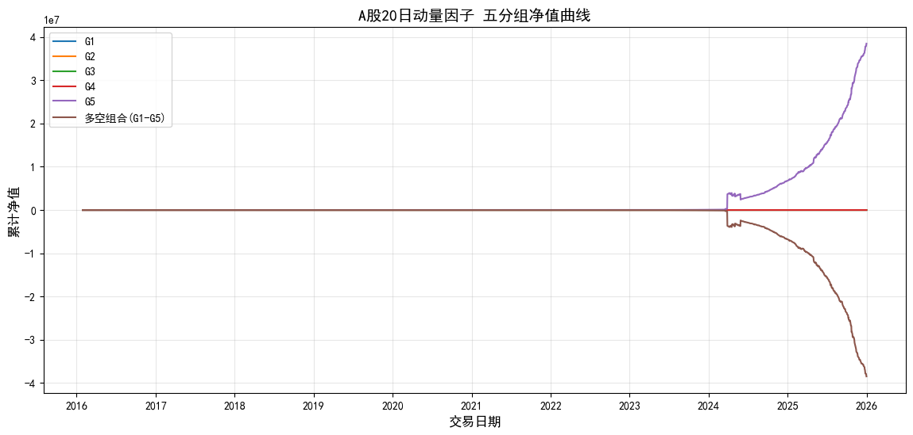

# 量化动量因子研究项目
Quantitative Momentum Factor Research | 量化策略实习专用项目

## 项目简介
本项目基于A股日频行情数据，完整复现了量化因子研究的标准全流程，从数据处理、因子构建、有效性检验到分组回测，完全贴合私募量化研究员（PR）的日常工作内容，可直接用于实习求职。

## 核心工作流程
1.  数据生成与处理
    - 生成模拟A股日频前复权行情数据（结构与真实A股完全一致，无需爬虫/外部接口）
    - 完成因子去极值（1%/99%分位数缩尾）、缺失值处理等研究端数据清洗
2.  因子构建
    - 实现经典20日动量因子：`动量 = 当日收盘价 / 20日前收盘价 - 1`
3.  因子有效性检验
    - 计算每日因子IC（Spearman秩相关系数）、ICIR（信息比率），验证因子对股票收益的预测能力
4.  分组回测与绩效分析
    - 按因子值将股票分为5组，计算各组累计净值
    - 构建多空组合（高动量组多，低动量组空），分析策略风险收益特征
    - 绘制分组净值曲线，直观展示因子效果

## 技术栈
- 编程语言：Python
- 数据处理：Pandas、NumPy
- 可视化：Matplotlib
- 统计分析：SciPy（Spearman相关系数）

## 回测结果展示

### 核心指标
- 因子IC均值：验证因子与未来收益的相关性
- ICIR：衡量因子收益的稳定性
- 分组净值：验证因子的单调性（高动量组收益显著高于低动量组）

## 项目亮点
- 流程标准规范：严格遵循量化投研的标准流程，可直接复现、可落地
- 无外部依赖：纯本地运行，无需付费数据源/接口，开箱即用

## 文件说明
- `main.ipynb`：完整项目代码（含数据生成、因子构建、回测、绘图全流程）
- `result.png`：回测结果净值曲线图
- `A股现成日线数据.csv`：生成的模拟行情数据
